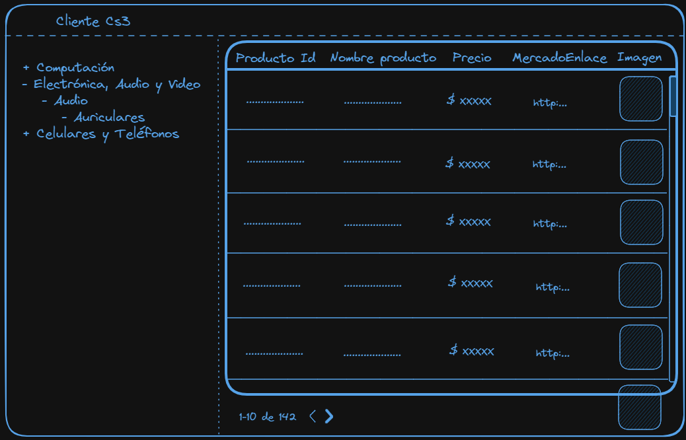

# Ejercicio de entrevista Frontend

Una empresa desea implementar un aplicativo en Reactjs o Next el cual permita enlistar sus productos, paginarlos y poder filtrarlos con base a ciertos parámetros. Esta información proviene de una API de Mercado Libre.

## Recursos

El `Seller ID` de la tienda del cliente es `179571326`, y que la API de Mercado Libre tiene un endpoint que permite buscar productos de un vendedor en particular, el endpoint es `https://api.mercadolibre.com/sites/MLA/search?seller_id=179571326`. También nos comentó que ingresando al endpoint desde el navegador podemos ver la respuesta en formato JSON junto con algo de información. El resto de la documentación de la API está disponible en [este link](https://developers.mercadolibre.com.ar/es_ar/items-y-busquedas).

Documentación para la paginación: [https://developers.mercadolibre.com.ar/devsite/paging-results-global-selling](https://developers.mercadolibre.com.ar/devsite/paging-results-global-selling)

## Requerimientos

- [ ]  Al entrar a la ruta `/` deberíamos ver un listado de los primeros 10 productos de la empresa en forma de tabla.
- [ ]  Al entrar a la ruta `/[category_id]` deberíamos ver un listado de productos correspondientes a esa categoría.
- [ ]  En todas las rutas, deberíamos ver un menú a la izquierda con las categorías disponibles. Las categorías deberían mostrarse en forma de árbol, es decir, si una categoría tiene subcategorías, deberían mostrarse como un submenú.
- [ ]  Las categorías deberían iniciar contraídas, y al hacer clik un botón de `-` o `+` deberían expandirse o contraerse individualmente.
- [ ]  Las categorías deberían mantener su estado de expansión/contracción al navegar entre rutas.
- [ ]  Al clikear una categoría, deberíamos navegar a la ruta `/[category_id]` correspondiente.
- [ ]  Al clikear un producto debería redirigirnos a la web de Mercado Libre para ese producto.
- [ ]  Si la consulta lo permite la tabla debe permitir paginar de manera eficiente sobre los productos.
- [ ]  La paginación deben ser consultas sobre los filtros actuales de la tabla (revisar la documentación mencionada en los **Recursos de la prueba**).
- [ ]  Las imágenes de los productos deben tener carga perezosa

## Ejemplo

## Puntos a evaluar

- [ ]  UI/UX - Se puede usar cualquier herramienta de diseño. Tailwind, framer motion, material UI, etc.
- [ ]  Las consultas deben de tener un caché que muestre una consulta ya realizada y a su vez que la rehidrate si hay un cambio.
- [ ]  Los filtros y las paginaciones no deben excluirse.
- [ ]  Calidad del código y buenas prácticas.
- [ ]  Claridad en los commits.
- [ ]  El diseño debe ser responsive (Opcional).
- [ ]  El enlistado de las filas deben ser animadas (Opcional, ejemplo: [link](https://github.com/TanStack/table/discussions/2386))

## Forma de entrega

El desarrollador debe crear un repositorio remoto en su Github el donde irá completando los requerimientos y que posteriormente anexará en la entrega.

### Preferencialmente

1. Tener un sitio con el proyecto deplegado
2. Subir una imagen Docker al cual se le pueda hacer pull y probar